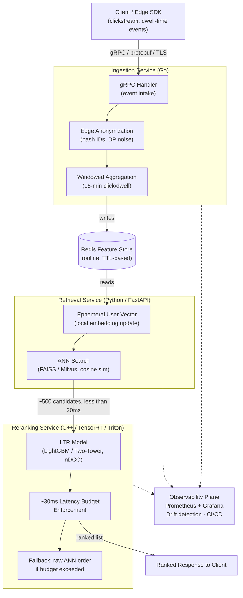

**Kasumi Engine: An APPI-Compliant, Low-Latency Real-Time Recommendation and Reranking System**

### Project Overview
Kasumi Engine is a production-grade, end-to-end real-time recommendation and reranking platform designed for high-velocity user engagement environments. It ingests live clickstream and dwell-time events, performs privacy-preserving candidate retrieval using vector search, and applies latency-constrained Learning-to-Rank (LTR) reranking — all while embedding **Japan's APPI (Act on the Protection of Personal Information)** compliance through privacy-by-design principles such as ephemeral session hashing, differential privacy techniques, and on-device/localized embedding updates.

The system demonstrates the ability to handle millions of items with sub-100ms P99 latency under high concurrency, bridging the gap between offline ML experiments and industrial MLOps. Built as a multi-language, microservices architecture, it serves as a flagship portfolio project showcasing systems-level ML engineering skills tailored to Tokyo tech companies like Mercari (e-commerce personalization) and SmartNews (real-time content feeds).

**Novelty (8/10)**: While two-stage retrieval-reranking pipelines are established in industry, Kasumi stands out through its tight integration of **APPI-aligned privacy mechanisms** (edge anonymization and federated-style local preference adjustments) directly into a high-throughput, polyglot stack (Go for ingestion, Python for retrieval, C++/TensorRT for inference). This creates a "privacy-native" system that minimizes train-serve skew and centralized tracking risks, while enforcing hard latency budgets with graceful degradation — features rarely combined at this fidelity in open-source or personal projects.

### System Diagram



### Core Architecture & Key Components

1. **High-Throughput Ingestion & Feature Store (Go + gRPC)**
   A lightweight, performant backend service ingests real-time user events via gRPC. An edge-anonymization layer strips or hashes persistent identifiers, converting sessions into ephemeral, differentially private vectors. Real-time windowed aggregations (e.g., category click frequency over 15 minutes) feed into a Redis-based feature store for low-latency online serving.
   - `internal/ingest`: protobuf-defined event schema, gRPC server, backpressure handling
   - `internal/anonymize`: SHA-256 salted hashing of session IDs, Laplace-mechanism DP noise injection on aggregate counters
   - `internal/aggregate`: sliding-window counters (Redis sorted sets / HyperLogLog for cardinality)

2. **Candidate Generation & Retrieval Layer (Python + ANN)**
   Upon request, ephemeral user embeddings are matched against an item catalog using Approximate Nearest Neighbors (FAISS IVF-PQ or Milvus) with cosine similarity. This rapidly narrows millions of items to ~500 candidates in <20ms. Non-IID challenges are addressed via localized embedding updates, reducing reliance on centralized raw behavioral histories.
   - `retrieval/index`: FAISS index build/refresh jobs, versioned index snapshots
   - `retrieval/api`: FastAPI async service, connection pooling to Redis + vector index
   - `retrieval/local_update`: per-session embedding delta computed at the edge, merged without persisting raw event history

3. **Latency-Constrained Reranking Layer (C++ / TensorRT / Triton)**
   A Learning-to-Rank model (LightGBM or Two-Tower) scores candidates using an nDCG-optimized objective for optimal ordering. Deployed via NVIDIA Triton Inference Server or an optimized ONNX runtime behind a FastAPI wrapper, it enforces a strict ~30ms execution budget with fallback to baseline retrieval scores. This ensures production viability under strict SLAs.
   - `reranking/model`: training pipeline (offline, `/notebooks`), ONNX export, TensorRT engine build
   - `reranking/serve`: Triton model repository config, dynamic batching, timeout-based fallback to unranked ANN order

4. **Production Observability & MLOps**
   Fully containerized with Docker Compose / local Kubernetes (Kind/K3s). Integrated Prometheus + Grafana monitoring tracks P50/P95/P99 latency, RPS, throughput, and metrics like feature skew. Automated drift detection and CI/CD practices complete the production story.
   - `deployment/k8s`: manifests/Helm charts per service, HPA on RPS
   - `deployment/monitoring`: Prometheus scrape configs, Grafana dashboards-as-code
   - `deployment/ci`: GitHub Actions — lint, unit tests, container build, canary deploy gate on latency regression

### Data Flow Summary
Client event → Go ingestion (anonymize + aggregate) → Redis feature store → Python retrieval (ANN, ~500 candidates, <20ms) → C++/Triton reranking (LTR, <30ms, fallback-safe) → ranked response, with Prometheus/Grafana observing every hop.

### Technical Highlights & Challenges Addressed
- **Privacy & Compliance**: Built-in APPI support via anonymization and minimal persistent storage — critical for Japanese tech environments.
- **Scale & Performance**: Multi-stage pipeline optimized for real-world non-stationary data, high concurrency, and strict latency (inspired by e-commerce and news personalization needs).
- **Polyglot Efficiency**: Leverages Go for ingestion speed, Python for ML flexibility, and C++ for inference acceleration.
- **MLOps Maturity**: Moves beyond notebooks with feature stores, telemetry, and monitoring — directly addressing common gaps in ML engineering portfolios.

### Why It Matters
Kasumi Engine proves capability in building systems that survive production constraints: real-time streaming, vector search at scale, low-latency inference, and regulatory compliance. It aligns closely with challenges at Mercari (two-stage ranking, LTR) and similar platforms, making it a strong signal for ML Systems / ML Engineering roles in Tokyo.

**Tech Stack**: Go, Python (FastAPI), C++/TensorRT, Redis, FAISS/Milvus, Triton, Docker/K8s, Prometheus/Grafana, GitHub Actions.

### Repo Structure
```
kasumi-engine/
├── ingestion/          # Go — gRPC intake, anonymization, windowed aggregation
├── retrieval/          # Python — FAISS/Milvus ANN service (FastAPI)
├── reranking/           # C++/TensorRT — Triton-served LTR model
├── deployment/          # Docker Compose, K8s manifests, CI/CD
│   ├── k8s/
│   ├── monitoring/      # Prometheus + Grafana configs
│   └── ci/
├── notebooks/           # Offline training, nDCG evaluation, drift analysis
├── benchmarks/          # Latency/throughput load-test scripts + results
└── docs/                 # README, this ARCHITECTURE.md, API specs
```

### Open Implementation Questions
- Which LTR model to start with — LightGBM (faster to ship, easier explainability) vs. a Two-Tower neural ranker (better held-out nDCG, more engineering overhead)?
- Milvus vs. FAISS-only for the index — Milvus adds operational complexity but simplifies horizontal scaling of the vector store.
- Exact DP noise budget (epsilon) for the aggregate counters — needs a concrete privacy/utility tradeoff decision before implementation.
